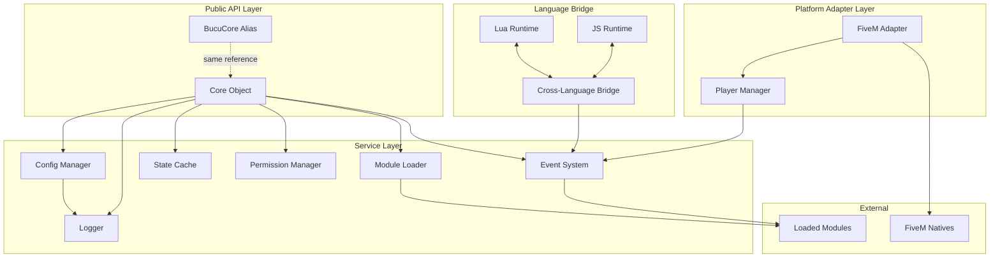
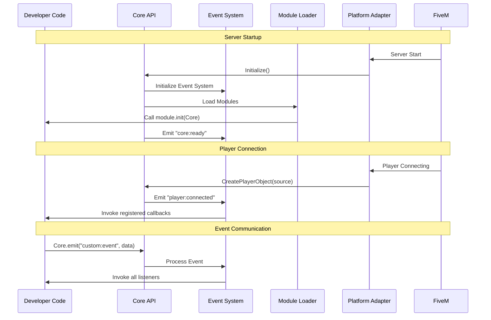
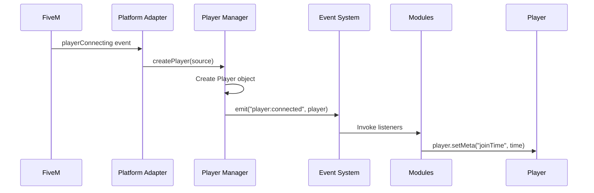
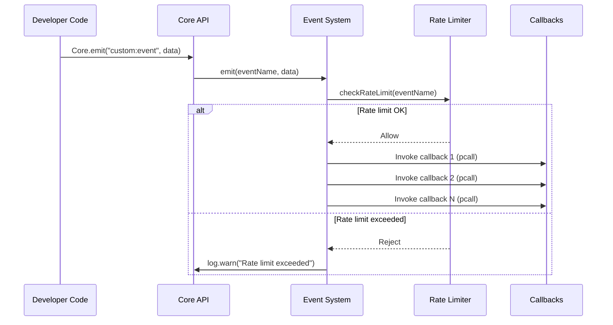
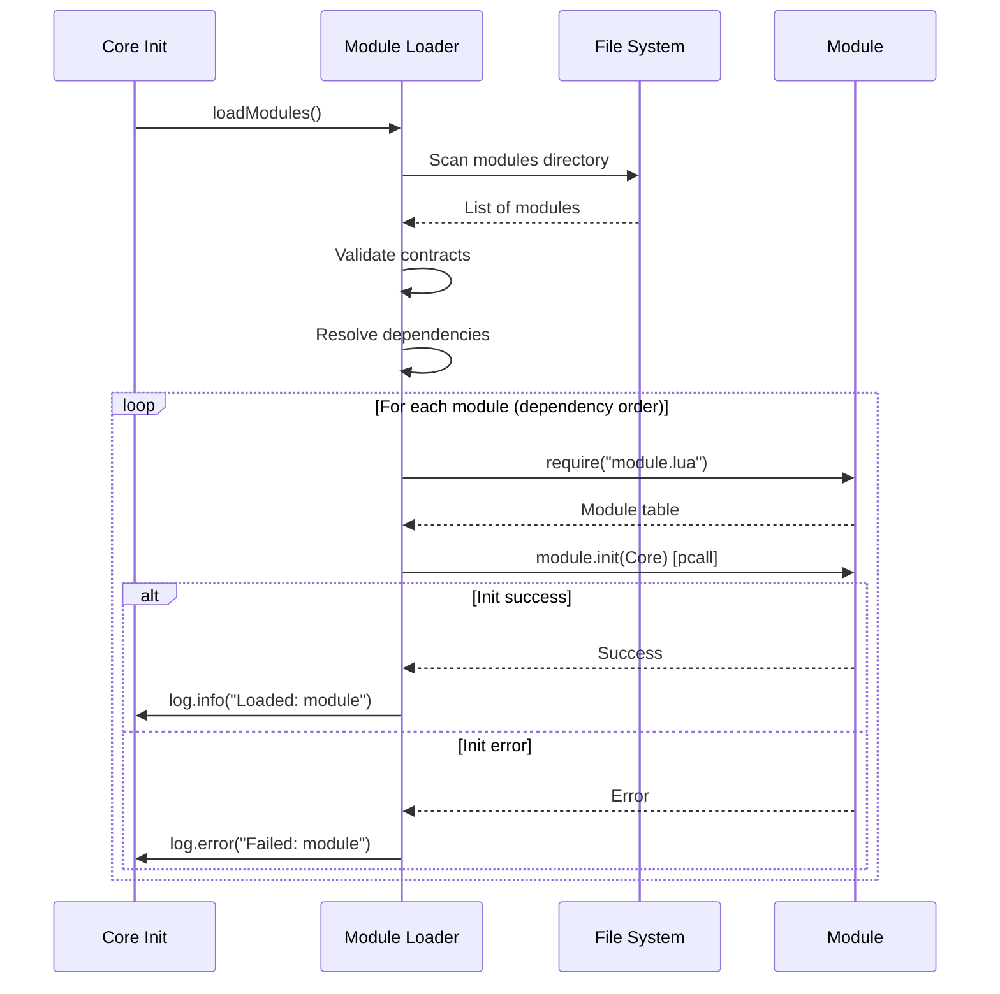

# Design Document: Bucu Core

## Overview

Bucu Core is architected as a lightweight, platform-agnostic framework with a clear separation between core logic and platform-specific adapters. The design emphasizes stability, extensibility, and developer experience through a layered architecture that isolates concerns and provides robust error handling.

The framework consists of five primary layers:
1. **Core API Layer**: Public-facing API exposed through the global Core/BucuCore object
2. **Service Layer**: Internal services (Event System, Module Loader, Permission Manager, State Cache)
3. **Platform Adapter Layer**: FiveM-specific bridge code
4. **Language Bridge Layer**: Lua-JavaScript interoperability
5. **Module Layer**: External extensions loaded at runtime

Key design principles:
- **Platform Agnostic Core**: Core logic has zero direct dependencies on FiveM APIs
- **Error Isolation**: All external code (modules, callbacks) runs in protected contexts
- **Immutable Public API**: v1.x contract enforced through interface stability
- **Dual Language Support**: Complete API parity between Lua and JavaScript
- **Fail-Safe Operation**: Graceful degradation when components fail

## Architecture

### High-Level Architecture



### Component Interaction Flow



### Directory Structure

```
bucu-core/
├── core/
│   ├── init.lua                 # Core initialization and API object
│   ├── init.js                  # JavaScript equivalent
│   ├── event-system.lua         # Event pub-sub implementation
│   ├── event-system.js
│   ├── module-loader.lua        # Module discovery and loading
│   ├── module-loader.js
│   ├── permission-manager.lua   # Permission system
│   ├── permission-manager.js
│   ├── state-cache.lua          # In-memory cache
│   ├── state-cache.js
│   ├── logger.lua               # Logging system
│   ├── logger.js
│   └── config-manager.lua       # Configuration loading
│       └── config-manager.js
├── platform/
│   ├── fivem-adapter.lua        # FiveM-specific bridge
│   ├── fivem-adapter.js
│   ├── player-manager.lua       # Player lifecycle management
│   └── player-manager.js
├── bridge/
│   ├── lua-js-bridge.lua        # Cross-language communication
│   └── js-lua-bridge.js
├── cli/
│   ├── bucu-cli.js              # CLI tool implementation
│   ├── commands/
│   │   ├── init.js
│   │   ├── create-module.js
│   │   └── dev.js
│   └── templates/               # Project and module templates
├── modules/
│   └── bucu-admin/              # Official reference module
│       ├── module.lua
│       ├── config.lua
│       └── commands/
├── config/
│   └── default-config.lua       # Default configuration
├── fxmanifest.lua               # FiveM resource manifest
└── package.json                 # NPM package definition
```

## Compone
nt Design

### 1. Core API Object

**Purpose**: Provide the primary interface for all framework functionality.

**Implementation Strategy**:
- Single global object with dual references (Core and BucuCore)
- Facade pattern to delegate to internal services
- Immutable public interface for v1.x stability

**Lua Implementation**:
```lua
Core = {
    version = "1.0.0",
    _services = {},  -- Internal service references
    
    -- Event System
    on = function(eventName, callback) end,
    emit = function(eventName, data) end,
    
    -- Player API
    getPlayer = function(source) end,
    getPlayers = function() end,
    
    -- Module API
    registerModule = function(module) end,
    
    -- Config API
    getConfig = function(key, default) end,
    
    -- Logging API
    log = {
        info = function(msg) end,
        warn = function(msg) end,
        error = function(msg) end,
        debug = function(msg) end
    },
    
    -- Cache API
    cache = {
        get = function(key) end,
        set = function(key, value, ttl) end,
        delete = function(key) end
    }
}

BucuCore = Core  -- Alias reference
```

**JavaScript Implementation**:
```javascript
const Core = {
    version: "1.0.0",
    _services: {},
    
    on: (eventName, callback) => {},
    emit: (eventName, data) => {},
    
    getPlayer: (source) => {},
    getPlayers: () => {},
    
    registerModule: (module) => {},
    
    getConfig: (key, defaultValue) => {},
    
    log: {
        info: (msg) => {},
        warn: (msg) => {},
        error: (msg) => {},
        debug: (msg) => {}
    },
    
    cache: {
        get: (key) => {},
        set: (key, value, ttl) => {},
        delete: (key) => {}
    }
};

global.BucuCore = Core;
```

### 2. Event System

**Purpose**: Provide loosely-coupled pub-sub communication.

**Design Decisions**:
- String-based event names with ':' namespace separator
- Multiple listeners per event (array storage)
- Error isolation per callback (pcall/try-catch)
- Synchronous execution in registration order

**Data Structures**:
```lua
EventSystem = {
    _listeners = {},  -- { [eventName] = { callback1, callback2, ... } }
    _rateLimits = {}, -- { [eventName] = { count, resetTime } }
}
```

**Key Methods**:
- `on(eventName, callback)`: Register listener
- `emit(eventName, data)`: Trigger event
- `off(eventName, callback)`: Unregister listener (optional)
- `_checkRateLimit(eventName)`: Internal rate limit validation

**Error Handling**:
```lua
function EventSystem:emit(eventName, data)
    local listeners = self._listeners[eventName] or {}
    for _, callback in ipairs(listeners) do
        local success, err = pcall(callback, data)
        if not success then
            Core.log.error(string.format(
                "Error in event '%s' callback: %s", 
                eventName, err
            ))
        end
    end
end
```

### 3. Player Object

**Purpose**: Abstract player data and operations.

**Design Decisions**:
- Lightweight wrapper around FiveM player source
- Metadata stored in State Cache
- Permissions stored in Permission Manager
- No persistent data (inventory, job, money)

**Structure**:
```lua
Player = {
    id = nil,           -- FiveM source ID
    name = "",          -- Player name
    identifier = "",    -- Unique identifier (license, steam, etc.)
    ping = 0,           -- Current ping
    
    getPermission = function(self) end,
    setPermission = function(self, role) end,
    getMeta = function(self, key) end,
    setMeta = function(self, key, value) end,
    kick = function(self, reason) end
}
```

**Lifecycle**:
1. Created on player connection via Platform Adapter
2. Stored in Player Manager cache
3. Cleaned up on player disconnection
4. Associated metadata cleared from State Cache

### 4. Module Loader

**Purpose**: Discover, validate, and initialize external modules.

**Module Contract**:
```lua
-- module.lua
return {
    name = "module-name",
    version = "1.0.0",
    author = "Author Name",
    dependencies = { "other-module" },  -- Optional
    
    init = function(Core)
        -- Module initialization
        Core.on("core:ready", function()
            -- Setup logic
        end)
    end
}
```

**Loading Process**:
1. Scan modules directory
2. Load config.lua for each module
3. Validate module contract
4. Resolve dependencies (topological sort)
5. Initialize modules in dependency order
6. Wrap init() in error handler

**Dependency Resolution**:
```lua
function ModuleLoader:_resolveDependencies(modules)
    local sorted = {}
    local visited = {}
    
    local function visit(moduleName)
        if visited[moduleName] then return end
        visited[moduleName] = true
        
        local module = modules[moduleName]
        if module.dependencies then
            for _, dep in ipairs(module.dependencies) do
                if not modules[dep] then
                    Core.log.error(string.format(
                        "Module '%s' requires missing dependency '%s'",
                        moduleName, dep
                    ))
                    return
                end
                visit(dep)
            end
        end
        
        table.insert(sorted, module)
    end
    
    for name, _ in pairs(modules) do
        visit(name)
    end
    
    return sorted
end
```

### 5. Permission System

**Purpose**: Manage player access control.

**Design Decisions**:
- Role-based permissions (string identifiers)
- Server-side validation only
- Cached in memory (no persistence in core)
- Event emission on permission changes

**Data Structure**:
```lua
PermissionManager = {
    _permissions = {},  -- { [playerId] = "role" }
}
```

**Key Methods**:
```lua
function PermissionManager:setPermission(playerId, role)
    self._permissions[playerId] = role
    Core.emit("permission:changed", {
        playerId = playerId,
        role = role
    })
end

function PermissionManager:getPermission(playerId)
    return self._permissions[playerId] or "user"
end

function PermissionManager:hasPermission(playerId, requiredRole)
    -- Role hierarchy check (to be implemented by modules)
    local playerRole = self:getPermission(playerId)
    return playerRole == requiredRole
end
```

### 6. State Cache

**Purpose**: Lightweight in-memory storage for runtime data.

**Design Decisions**:
- Simple key-value store
- Optional TTL support
- No persistence (memory only)
- Namespace support via key prefixes

**Data Structure**:
```lua
StateCache = {
    _cache = {},  -- { [key] = { value, expiry } }
}
```

**Key Methods**:
```lua
function StateCache:set(key, value, ttl)
    local expiry = ttl and (os.time() + ttl) or nil
    self._cache[key] = { value = value, expiry = expiry }
end

function StateCache:get(key)
    local entry = self._cache[key]
    if not entry then return nil end
    
    if entry.expiry and os.time() > entry.expiry then
        self._cache[key] = nil
        return nil
    end
    
    return entry.value
end

function StateCache:delete(key)
    self._cache[key] = nil
end
```

### 7. Logger

**Purpose**: Structured logging with severity levels.

**Design Decisions**:
- Four severity levels: debug, info, warn, error
- Configurable log level filtering
- Timestamp and context in all messages
- Console output (extensible to file/remote)

**Implementation**:
```lua
Logger = {
    level = "info",  -- Configurable: debug, info, warn, error
    
    _levels = {
        debug = 1,
        info = 2,
        warn = 3,
        error = 4
    }
}

function Logger:_log(level, message)
    if self._levels[level] < self._levels[self.level] then
        return
    end
    
    local timestamp = os.date("%Y-%m-%d %H:%M:%S")
    local formatted = string.format(
        "[%s] [%s] %s",
        timestamp,
        level:upper(),
        message
    )
    
    print(formatted)
end

function Logger:info(msg) self:_log("info", msg) end
function Logger:warn(msg) self:_log("warn", msg) end
function Logger:error(msg) self:_log("error", msg) end
function Logger:debug(msg) self:_log("debug", msg) end
```

### 8. Config Manager

**Purpose**: Load and provide access to configuration.

**Design Decisions**:
- Lua table-based configuration
- Default values for missing keys
- Validation on load
- Immutable after initialization

**Configuration Structure**:
```lua
-- config/default-config.lua
return {
    core = {
        version = "1.0.0",
        devMode = false,
        logLevel = "info"
    },
    
    modules = {
        directory = "modules",
        autoLoad = true
    },
    
    rateLimit = {
        enabled = true,
        defaultLimit = 100,
        window = 60  -- seconds
    },
    
    cache = {
        defaultTTL = 300  -- seconds
    }
}
```

**Key Methods**:
```lua
function ConfigManager:load(configPath)
    local config = require(configPath)
    self._config = config
    self:_validate()
end

function ConfigManager:get(key, default)
    local keys = {}
    for k in string.gmatch(key, "[^.]+") do
        table.insert(keys, k)
    end
    
    local value = self._config
    for _, k in ipairs(keys) do
        value = value[k]
        if value == nil then return default end
    end
    
    return value
end
```

### 9. Platform Adapter (FiveM)

**Purpose**: Bridge Core and FiveM-specific APIs.

**Design Decisions**:
- Only component that imports FiveM natives
- Translates FiveM events to Core events
- Manages player lifecycle
- Provides network event registration

**Key Responsibilities**:
```lua
FiveMAdapter = {
    init = function()
        -- Register FiveM event handlers
        AddEventHandler("playerConnecting", function(name, setKickReason, deferrals)
            -- Handle player connection
        end)
        
        AddEventHandler("playerDropped", function(reason)
            -- Handle player disconnection
        end)
        
        -- Register network events
        RegisterNetEvent("bucu:clientEvent")
        AddEventHandler("bucu:clientEvent", function(data)
            -- Bridge to Core event system
            Core.emit("client:event", data)
        end)
    end,
    
    triggerClient = function(source, eventName, data)
        TriggerClientEvent(eventName, source, data)
    end,
    
    getPlayerName = function(source)
        return GetPlayerName(source)
    end,
    
    getPlayerIdentifiers = function(source)
        return GetPlayerIdentifiers(source)
    end
}
```

### 10. Language Bridge (Lua-JavaScript)

**Purpose**: Enable cross-language event communication.

**Design Decisions**:
- Shared event system between Lua and JavaScript
- JSON serialization for data transfer
- Bidirectional communication

**Lua Side**:
```lua
LuaJSBridge = {
    emitToJS = function(eventName, data)
        -- Serialize and send to JS runtime
        exports["bucu-core"]:emitToJS(eventName, json.encode(data))
    end,
    
    onFromJS = function(eventName, callback)
        -- Register listener for JS events
        Core.on("js:" .. eventName, callback)
    end
}
```

**JavaScript Side**:
```javascript
const JSLuaBridge = {
    emitToLua: (eventName, data) => {
        // Send to Lua runtime
        global.exports["bucu-core"].emitToLua(
            eventName, 
            JSON.stringify(data)
        );
    },
    
    onFromLua: (eventName, callback) => {
        // Register listener for Lua events
        Core.on(`lua:${eventName}`, callback);
    }
};
```

### 11. CLI Tool

**Purpose**: Streamline development workflows.

**Commands**:

**bucu init**:
```bash
bucu init my-server
```
Creates:
- Project directory structure
- Default configuration
- Example module
- FiveM resource manifest

**bucu create module**:
```bash
bucu create module my-module
```
Generates:
- module.lua with contract template
- config.lua with default settings
- README.md with documentation template

**bucu dev**:
```bash
bucu dev
```
Enables:
- Hot reload watching
- Verbose logging
- Development mode flag

**Implementation**:
```javascript
// cli/bucu-cli.js
const { Command } = require('commander');
const program = new Command();

program
    .name('bucu')
    .description('Bucu Core CLI Tool')
    .version('1.0.0');

program
    .command('init <name>')
    .description('Initialize a new Bucu Core project')
    .action(require('./commands/init'));

program
    .command('create module <name>')
    .description('Create a new module')
    .action(require('./commands/create-module'));

program
    .command('dev')
    .description('Start development mode')
    .action(require('./commands/dev'));

program.parse();
```

### 12. Hot Reload System

**Purpose**: Reload code changes without server restart.

**Design Decisions**:
- Development mode only
- File watcher on modules directory
- Graceful fallback on reload errors
- State preservation where possible

**Implementation Strategy**:
```lua
HotReload = {
    _watchers = {},
    
    watch = function(self, modulePath)
        -- Watch file for changes
        -- On change: unload and reload module
    end,
    
    reloadModule = function(self, moduleName)
        local success, err = pcall(function()
            -- Unload old module
            package.loaded[moduleName] = nil
            
            -- Reload module
            local module = require(moduleName)
            
            -- Re-initialize
            module.init(Core)
            
            Core.log.info("Hot reloaded: " .. moduleName)
        end)
        
        if not success then
            Core.log.error("Hot reload failed: " .. err)
        end
    end
}
```

## Data Flow

### Player Connection Flow



### Event Emission Flow



### Module Loading Flow



## Error Handling Strategy

### Error Isolation Layers

1. **Module Initialization**: Wrapped in pcall/try-catch
2. **Event Callbacks**: Each callback wrapped individually
3. **API Input Validation**: Type and range checks
4. **Platform Adapter**: FiveM native call protection

### Error Recovery

```lua
function Core:_safeCall(fn, context, ...)
    local success, result = pcall(fn, ...)
    
    if not success then
        self.log.error(string.format(
            "Error in %s: %s",
            context,
            result
        ))
        return nil, result
    end
    
    return result
end
```

### Error Reporting

Development Mode:
- Full stack traces
- File names and line numbers
- Verbose context

Production Mode:
- Sanitized error messages
- Error codes
- Minimal context

## Performance Considerations

### Optimization Strategies

1. **Event System**: 
   - Direct table lookup for listeners
   - No event queue (synchronous execution)
   - Rate limiting to prevent abuse

2. **State Cache**:
   - In-memory only (no I/O)
   - Lazy expiry checking
   - Namespace prefixes for organization

3. **Player Objects**:
   - Lightweight wrappers
   - Metadata stored separately
   - Cleanup on disconnect

4. **Module Loading**:
   - One-time initialization
   - Dependency caching
   - No runtime module discovery

### Memory Management

- Player cache cleared on disconnect
- Cache entries with TTL auto-expire
- Module references maintained (no unloading in production)
- Event listeners stored by reference (no duplication)

## Security Considerations

### Input Validation

```lua
function Core:emit(eventName, data)
    assert(type(eventName) == "string", "Event name must be a string")
    assert(eventName ~= "", "Event name cannot be empty")
    
    return self._services.eventSystem:emit(eventName, data)
end
```

### Permission Validation

- All permission checks server-side only
- No client-side permission data exposure
- Permission changes emit events for audit logging

### Rate Limiting

- Per-event rate limits
- Configurable thresholds
- Automatic reset windows
- Logging of limit violations

## Testing Strategy

### Unit Tests

- Each service tested independently
- Mock dependencies
- Test error handling paths
- Validate API contracts

### Integration Tests

- Module loading scenarios
- Event system communication
- Player lifecycle
- Cross-language bridge

### Manual Testing

- FiveM server integration
- Performance under load
- Hot reload functionality
- CLI tool commands

## Deployment

### FiveM Resource Structure

```
resources/
└── bucu-core/
    ├── fxmanifest.lua
    ├── core/
    ├── platform/
    ├── bridge/
    ├── config/
    └── modules/
```

### fxmanifest.lua

```lua
fx_version 'cerulean'
game 'gta5'

name 'Bucu Core'
description 'Lightweight core framework for FiveM'
author 'Bucu Team'
version '1.0.0'

-- Lua files
server_scripts {
    'core/init.lua',
    'core/event-system.lua',
    'core/module-loader.lua',
    'core/permission-manager.lua',
    'core/state-cache.lua',
    'core/logger.lua',
    'core/config-manager.lua',
    'platform/fivem-adapter.lua',
    'platform/player-manager.lua',
    'bridge/lua-js-bridge.lua'
}

-- JavaScript files
server_scripts {
    '@bucu-core/core/init.js',
    '@bucu-core/core/event-system.js',
    '@bucu-core/core/module-loader.js',
    '@bucu-core/core/permission-manager.js',
    '@bucu-core/core/state-cache.js',
    '@bucu-core/core/logger.js',
    '@bucu-core/core/config-manager.js',
    '@bucu-core/platform/fivem-adapter.js',
    '@bucu-core/platform/player-manager.js',
    '@bucu-core/bridge/js-lua-bridge.js'
}

-- Dependencies
dependencies {
    '/server:5848',  -- Minimum FiveM server version
    '/onesync'       -- OneSync required
}
```

## Migration Path

### From Existing Frameworks

1. **Identify Core Dependencies**: Map existing framework calls to Bucu Core API
2. **Create Adapter Module**: Build compatibility layer as a module
3. **Incremental Migration**: Move features one at a time
4. **Deprecation Period**: Support old API alongside new API
5. **Complete Cutover**: Remove old framework

### Version Upgrades (v1.x to v1.y)

- Backward compatible by design
- No breaking changes
- Deprecation warnings for old patterns
- Migration guide for new features

### Major Version (v1.x to v2.x)

- Breaking changes allowed
- Comprehensive migration guide
- Automated migration tool (CLI)
- Parallel support period

## Future Considerations

### Potential v2.x Features

- Async event system (promises/coroutines)
- Built-in database abstraction
- WebSocket support for external tools
- Plugin marketplace integration
- Performance monitoring and metrics
- Distributed caching support

### Extensibility Points

- Custom logger backends
- Alternative cache implementations
- Additional platform adapters (RedM, etc.)
- Event middleware system
- Module dependency injection

## Conclusion

This design provides a solid foundation for Bucu Core v1.x with clear separation of concerns, robust error handling, and extensibility through modules. The architecture prioritizes stability and developer experience while maintaining the flexibility to evolve in future major versions.
